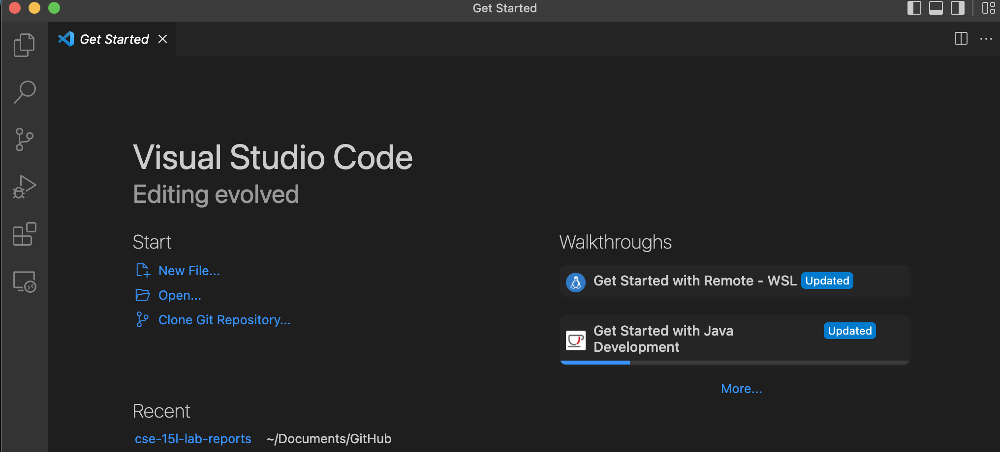
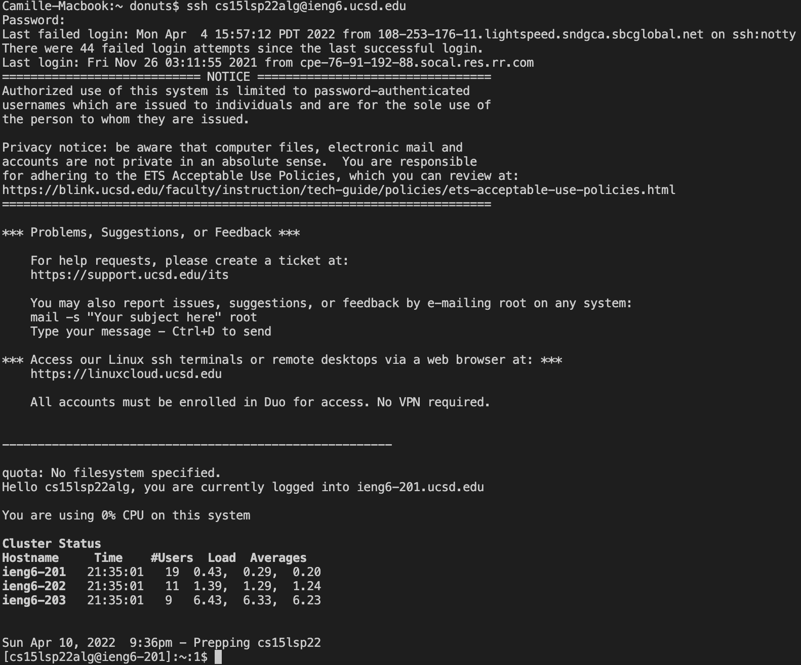
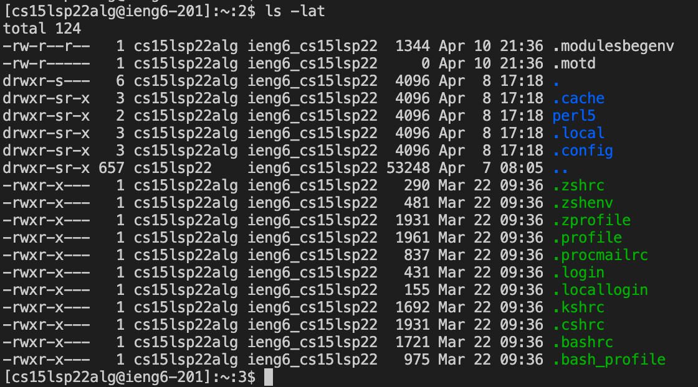
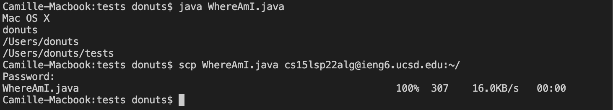

# Week 2: Lab report 1
## **Step 1:** Installing VScode
__Download Visual Code Studio__ using the following link: 
[Link][1]
[1]: https://code.visualstudio.com/ 
and choose the version meant for your computer. Home page should look like this: 


## **Step 2:** Remotely Connecting
- Look up course specific account through
[Link][2]
[2]: https://sdacs.ucsd.edu/~icc/index.php 
- should look something like cs15lwi22aoq where the ‘aoq’ refers to the course-specific account
- open a termnial (should be on top of the computer screen) in Visual Code
- use the a command with the following format:
```$ ssh cs15lwi22aoq@ieng6.ucsd.edu``` in the terminal 
- ssh command outputs a password request
- type password (input is invisible for security purposes) then press enter
- result should look like following screenshot: 


## **Step 3:** Trying Some Commands
Try running some commands such as cd, ls, pwd, mkdir, and cp. The specific command used in the screenshot is ```ls -lat```, which outputs a list of computer files in Unix or Unix-like systems (in this case, in MacOSX)


## **Step 4:** Moving Files with scp
- Create folder called test
- Create java file in folder called WhereAmI.java 
- Save the following text content in file:
```
class WhereAmI {
  public static void main(String[] args) {
    System.out.println(System.getProperty("os.name"));
    System.out.println(System.getProperty("user.name"));
    System.out.println(System.getProperty("user.home"));
    System.out.println(System.getProperty("user.dir"));
  }
}
```
- run following command: java WhereAmI.java 
- __move files using the scp command__ by running ```scp WhereAmI.java cs15lwi22alg@ieng6.ucsd.edu:~/```
- type password (should be the same as when you logged in to ssh)
 
 

 ## **Step 5:** Setting an SSH Key
- type ssh-keygen in terminal
- This command generates an enter file message
- type format (subsituting user-name)
```
(/Users/<user-name>/.ssh/id_rsa): (/Users/<user-name>/.ssh/id_rsa):
```
- Press Enter for an empty passphrase
- To ssh or scp without having to enter a password, ssh and run ```mkdir .ssh```, then ```<logout>```. Afterwards input:
```
scp /Users/donuts/.ssh/id_rsa.pub. cs15lwi22aoq@ieng6.ucsd.edu:~/.ssh/authorized_keys
```

## **Step 6:** 


